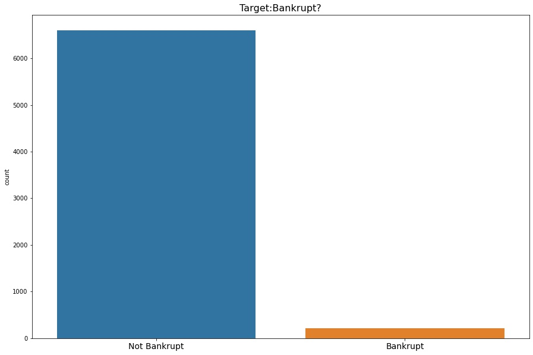

# Bankruptcy Prediction in Taiwan

By Ramil Chaimongkolbutr, Erin Vu

## Overview

We will be using data from the Taiwan Economic Journal on company financial statuses from 1999 to 2009 from [Kaggle](https://www.kaggle.com/fedesoriano/company-bankruptcy-prediction) to build models that classify if a company is bankrupt or not. We will then use that model to predict if a company will bankrupt or not in order for our stakeholder, a Taiwanese hedge fund, to make better, guided decisions towards short positions.

## Business Problem

Our stakeholder is a Taiwanese hedge fund looking to profit via short selling companies operating in Taiwan. Our business problem is a classification problem to predict if a company will go bankrupt in order to advise our stakeholder on whether or not they should decide to take a short position in a company. A short position is borrowing company stock, selling it, and buying it back when it's valued less than borrow price. It is imperative that we do not mistakenly build our model to classify companies as going bankrupt as it would result in huge financial losses since the hedge fund will need to pay back the amount of stock borrowed. In order to avoid misclassifying false positives, we will tune our model with respect to precision accordingly.

## Data

Our data is from the Taiwan Economic Journal on company financial statuses from 1999 to 2009 from [Kaggle](https://www.kaggle.com/fedesoriano/company-bankruptcy-prediction). Every row is a company in Taiwan and there are 95 columns of data on the company's financial information. Some of the features include debt ratio, net income to assets, return on assets, earnings per share, and many others. Below we can see the distribution of our target variable, 'Bankrupt?'

## Methods

This project uses exploratory data analysis in order to manipulate and understand our data. We also iterate through many machine learning models such as [Logistic Regression](https://scikit-learn.org/stable/modules/generated/sklearn.linear_model.LogisticRegression.html), [Random Forest Classifier](https://scikit-learn.org/stable/modules/generated/sklearn.ensemble.RandomForestClassifier.html#sklearn.ensemble.RandomForestClassifier.feature_importances_), [XGBoost](https://xgboost.readthedocs.io/en/latest/#), and [CatBoost](https://catboost.ai/). Within these models, we looked at using different parameters for the models in in order to hopefully optimize for our best parameters for the best performing model on not only the training data, but also the testing data. 

## Results

We iterated through our models and saw that XGBoost performed favorably for our business problem. Although we were able to extract the magnitude of the feature importances using XGBoost, we found that our XGBoost model performed worse on our testing data. Our precision score decreased from 95% to 39%.

## Final Analysis and Conclusion
We tuned our models towards precision to minimize Type I errors, also known as false positives. The model with the highest training precision score was our XGBoost model. When we ran this model on our testing set, it did not perform as well as on the training set. This might be because we did not include the threshold into cross validation. 

### Next Steps
Further analysis we could pursue to better predict bankruptcy in Taiwan: 
- We can manually run Stratified K Folding with threshold implementation to fix the threshold issue
- Add data and information such as dates of bankruptcy
- Continue to think of new parameters and different modelling strategies 

# 7. For More Information

Please review our full analysis in our [Jupyter Notebook](https://github.com/ekvu/phase-3_project/blob/main/Final%20Notebook.ipynb) and our [presentation](https://github.com/ekvu/phase-3_project/blob/main/Taiwanese_Bankruptcy_Presentation.pdf). The data can be found in [data](https://github.com/ekvu/phase-3_project/tree/main/data), images in [images](https://github.com/ekvu/phase-3_project/tree/main/images), and our working notebooks in [working_notebooks](https://github.com/ekvu/phase-3_project/tree/main/working_notebooks).

For additional questions, please contact:

Ramil Chaimongkolbutr at ramil.ming@gmail.com, [LinkedIn](linkedin.com/in/ramilc), and [GitHub](github.com/ramilchai)

Erin Vu at erin.vu94@gmail.com and [LinkedIn](linkedin.com/in/erin-vu)
